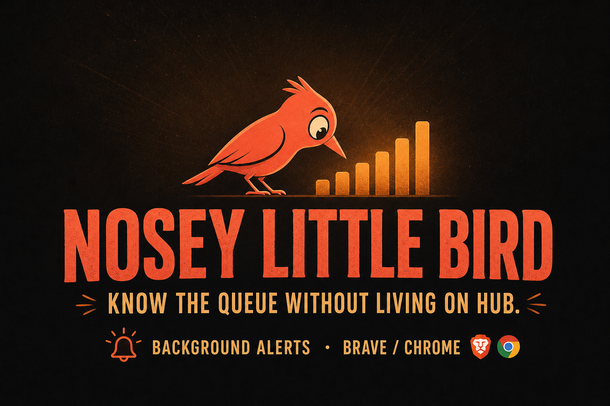
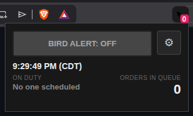
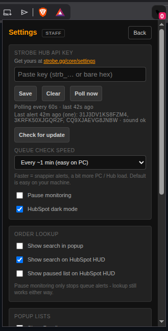
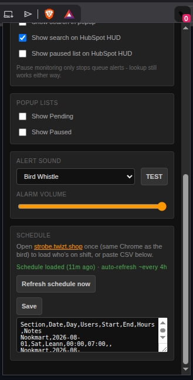

# Nosey Little Bird

**See the Strobe queue without living on the Hub page.**

Staff keep Brave (or Chrome) running. Each person pastes their own Strobe Hub API key once. The bird watches unfilled orders in the background and alerts when the queue is sitting too long — so nobody has to leave HubSpot, YouTube, or another tab open on Strobe just to know work is piling up.

---

---

## What you get

- **Background queue watch** — badge = unfilled count; desktop alert + sound when Strobe orders age past your Bird Alert level (Strobe page does not need to stay open)
- **Your key, your browser** — each person uses their own Hub API key from settings
- **HubSpot helpers** (when live messages is open) — dark mode, one-click copy for order IDs / dodo codes, optional lookup HUD — not HubSpot alerts
- **Who’s on shift** — unlock strobe.twizt.shop once; bird refreshes the schedule about every 4 hours. If Access needs a new code, it tells you the bird can’t fly without it

---

## Install

1. Download **`nosey-little-bird-*-staff.zip`** from  
   **[Latest release](https://github.com/TWIZT-SHOP/nosey-little-bird/releases/latest)**  
   (the named zip — **not** “Source code”) → unzip
2. Open `brave://extensions` or `chrome://extensions`
3. Turn on **Developer mode**
4. **Load unpacked** → pick the folder that contains `manifest.json`
5. Pin the bird icon so the badge stays visible

**Updating:** Reload the extension (or remove + load the new folder), then refresh HubSpot if you use the HUD.

**Picture walkthrough:** [docs/STAFF-GUIDE.md](docs/STAFF-GUIDE.md)

---

## First-time setup

### 1. Main popup

Click the bird. Tap **BIRD ALERT** to cycle levels. Gear opens Settings. Badge on the icon = orders in queue.

### 2. Paste your API key

⚙ Settings → get your key at [strobe.gg/core/settings](https://strobe.gg/core/settings) → paste → **Save**. Use **your own** key. Don’t share it. You should see polling status under the buttons.

### 3. Load who’s on duty

Open [strobe.twizt.shop](https://strobe.twizt.shop/) once in the **same** browser profile (Access code / sign-in if asked), or paste schedule CSV → **Save**. Green “Schedule loaded” means you’re good. Bird auto-refreshes about every 4 hours.

### 4. Optional

- Alert sound + volume — hit **TEST** once  
- Queue check speed (default is easy on your PC)  
- **Pause monitoring** stops queue alerts only — lookup still works  

---

## Day to day

- Badge = how many unfilled orders are waiting
- Popup = local time, who’s on duty, queue snapshot
- **1 ORDER** = alert once when a waiting order shows up (handy on slow nights). Already-seen orders stay quiet until they leave and come back — cycle the button back to **1 ORDER** to re-arm a ping for what’s in queue now.
- Red flash = something has sat **15+ minutes**
- Queue alerts keep working with the Strobe page closed (alerts are for the Hub queue, not HubSpot)
- **Updates:** when Brave starts (or you Reload the extension), the bird checks GitHub once for a newer staff zip. If one exists, you’ll get a prompt — **Update** downloads it; unzip over your bird folder and Reload. Settings → **Check for update** runs that check manually.
- **Schedule refresh:** about every 4 hours (and on Brave start). If Cloudflare Access needs a new code, you get a clear warning — open the schedule site and sign in again.

---

## Privacy

Your API key stays in your browser profile only. Don’t paste keys, real order IDs, or customer chat into group chats when asking for help.

---

Built for Strobe Hub staff ops. Unofficial helper — does not replace HubSpot or Strobe Hub.
