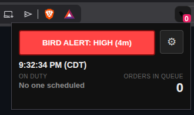
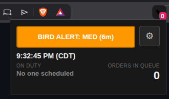
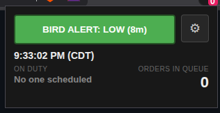
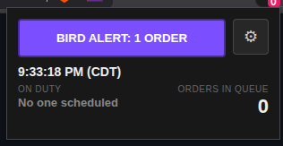
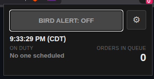
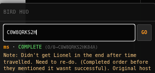

# Staff picture guide

How the bird looks after install, and what to do in Settings.

---

## Main popup

Click the bird icon (pin it so the badge stays visible).

| Piece | What it means |
|--------|----------------|
| **BIRD ALERT** | Tap to cycle HIGH / MED / LOW / 1 ORDER / OFF |
| **⚙** | Opens Settings |
| Clock | Your local time |
| **ON DUTY** | Who’s on Nookmart from the schedule (needs schedule unlocked once) |
| **ORDERS IN QUEUE** | Unfilled / waiting count — same number as the badge on the icon |

---

## Bird Alert levels

Tap the big button to cycle. Color changes with the mode.

| Mode | When it alerts |
|------|----------------|
| **HIGH (4m)** | Waiting order older than ~4 minutes |
| **MED (6m)** | Waiting order older than ~6 minutes |
| **LOW (8m)** | Waiting order older than ~8 minutes |
| **1 ORDER** | Once when any waiting order shows up (slow nights) |
| **OFF** | No queue sound / desktop alert |

**1 ORDER tip:** already-seen orders stay quiet until they leave and come back. Cycle back to **1 ORDER** to re-arm a ping for what’s in queue now.

---

## Bird HUD (HubSpot)

When HubSpot live messages is open, the bird can show a small **BIRD HUD** for order lookup (Settings → **Show search on HubSpot HUD**).

- Paste an order ID (or partial) → **GO**
- Status line shows result (e.g. COMPLETE) and the matched ID
- Note text is from the Hub order — handy without leaving the chat
- This is a **helper**, not HubSpot alerts; queue alerts still come from the bird icon / API key

---

## Settings — API key & queue watch

Gear → Settings. Paste **your own** Hub key (don’t share it).

1. Get a key at [strobe.gg/core/settings](https://strobe.gg/core/settings)
2. Paste → **Save**
3. You should see **Polling every … · last … ago**
4. Optional: **Poll now**, **Queue check speed**, **Check for update**
5. **Pause monitoring** stops queue alerts only — lookup still works

---

## Settings — schedule (who’s on duty)

Scroll down in Settings for the schedule block.

1. Open [strobe.twizt.shop](https://strobe.twizt.shop/) once in the **same** Brave/Chrome profile as the bird (sign in / Access code if asked)
2. Status should turn green: **Schedule loaded (… ago) · auto-refresh ~every 4h**
3. Or paste CSV and hit **Save**
4. Use **Refresh schedule now** anytime

If Access needs a new code, the bird warns you: **Bird can't fly without the schedule code** — open the schedule site and sign in again.

---

## Install (zip)

1. Download **`nosey-little-bird-*-staff.zip`** from the [latest release](https://github.com/TWIZT-SHOP/nosey-little-bird/releases/latest) (named zip — not “Source code”) → unzip  
2. `brave://extensions` or `chrome://extensions` → **Developer mode** on  
3. **Load unpacked** → folder that contains `manifest.json`  
4. Pin the bird  

Full product notes: [README](../README.md).
